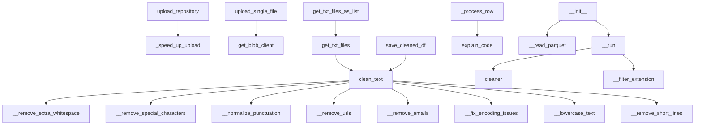

# Repository Overview and Structure

---

## Table of Contents

1. [Introduction](#introduction)
2. [Project Structure](#project-structure)
3. [Core Components](#core-components)
4. [Key Relationships](#key-relationships)
5. [Extending and Customizing](#extending-and-customizing)
6. [Getting Started](#getting-started)
7. [Conclusion](#conclusion)

---

## Introduction

Welcome to the **Repository Overview and Structure** document. This guide provides a comprehensive, high-level understanding of the repository's purpose, organization, and extensibility. It is designed to help developers, contributors, and stakeholders quickly familiarize themselves with the codebase, its architecture, and best practices for usage and extension.

Whether you are onboarding to the project, planning to contribute, or simply exploring, this document will serve as your roadmap to efficiently navigate, utilize, and extend the repository.

---

## Project Structure

### High-Level Overview

The repository is organized around a **microservices architecture**, primarily divided into two main pipelines:

- **Input Integration Pipeline** (`microservices/input_integration_pipeline`)
- **Transforming Pipeline** (`microservices/transforming_pipeline`)

Each pipeline contains multiple services and components, further structured into logical directories such as `source`, `components`, `endpoints`, `tests`, and `utilities`.

---

### Directory Tree

<details>
<summary><strong>Click to expand the full directory tree</strong></summary>

```
.
├── microservices
│   ├── input_integration_pipeline
│   │   ├── source
│   │   │   ├── fetch_repo_from_blob
│   │   │   │   ├── endpoints/
│   │   │   │   │   └── api.py
│   │   │   │   ├── source/
│   │   │   │   │   └── schemas.py
│   │   │   │   ├── tests/
│   │   │   │   │   └── test_fetch_repo_from_blob.py
│   │   │   │   ├── utilities/
│   │   │   │   │   ├── chunk_rows.py
│   │   │   │   │   └── retry.py
│   │   │   │   └── main.py
│   │   │   ├── repo_downloader
│   │   │   │   ├── endpoints/
│   │   │   │   │   └── status.py
│   │   │   │   ├── source/
│   │   │   │   │   └── __init__.py
│   │   │   │   ├── tests/
│   │   │   │   │   └── __init__.py
│   │   │   │   └── main.py
│   │   │   └── upload_repo_on_blob
│   │   │       ├── src/
│   │   │       │   ├── config/
│   │   │       │   │   └── settings.py
│   │   │       │   ├── endpoints/
│   │   │       │   │   └── endpoint_uploader.py
│   │   │       │   ├── services/
│   │   │       │   │   └── uploader.py
│   │   │       │   └── utils/
│   │   │       │       └── helpers.py
│   │   │       ├── tests/
│   │   │       │   ├── __init__.py
│   │   │       │   └── test_endpoints.py
│   │   │       └── main.py
│   │   └── tests/
│   │       └── test_workflow.py
│   └── transforming_pipeline
│       ├── components
│       │   ├── anonimization
│       │   │   ├── endpoints/
│       │   │   │   └── anonimizator_api.py
│       │   │   ├── source/
│       │   │   │   └── __init__.py
│       │   │   └── tests/
│       │   │       └── test_anonimizator_azure.py
│       │   ├── cleaning_and_transformation
│       │   │   ├── endpoints/
│       │   │   │   ├── __init__.py
│       │   │   │   └── api.py
│       │   │   ├── source/
│       │   │   │   ├── schemas.py
│       │   │   │   ├── text_cleaner.py
│       │   │   │   └── text_cleaning_services.py
│       │   │   ├── tests/
│       │   │   │   └── test_parquet_creator.py
│       │   │   ├── README.py
│       │   │   └── main.py
│       │   ├── enrichment
│       │   │   └── README.py
│       │   ├── md_to_txt
│       │   │   ├── endpoints/
│       │   │   │   └── api.py
│       │   │   ├── source/
│       │   │   │   ├── converter.py
│       │   │   │   └── schemas.py
│       │   │   ├── tests/
│       │   │   │   └── test.py
│       │   │   └── main.py
│       │   ├── python_to_text_conversion
│       │   │   ├── filtering/
│       │   │   │   ├── source/
│       │   │   │   │   └── cleaner_comments.py
│       │   │   │   └── main.py
│       │   │   └── llm_explainer/
│       │   │       ├── source/
│       │   │       │   ├── python_explainer.py
│       │   │       │   └── utils/
│       │   │       │       └── prompt.py
│       │   └── standardization
│       │       └── README.py
│       ├── main.py
│       └── splitter.py
├── test2.py
```
</details>

---

### Key Folders and Their Purpose

- **`microservices/input_integration_pipeline/`**:  
  - `source/`: Main services for input integration (fetching, downloading, uploading repositories).
  - `tests/`: Integration and workflow tests for the input pipeline.

- **`microservices/transforming_pipeline/`**:  
  - `components/`: Modular data transformation components (anonymization, cleaning, enrichment, conversion, etc.).
  - `main.py`: Entry point for the transforming pipeline.
  - `splitter.py`: Handles data splitting logic.

- **Other Notable Files**:  
  - `test2.py`: Standalone script at the root level, possibly for testing or demonstration.

---

### File and Folder Naming Conventions

- `main.py`: Entry point for services or components.
- `endpoints/`: API route definitions and handlers.
- `source/`: Core business logic and data models.
- `tests/`: Unit and integration tests.
- `utilities/` or `utils/`: Helper functions and utilities.
- `config/`: Configuration files and settings.

---

### Example: Adding a New Component

To add a new transformation component, follow the established structure:

```bash
microservices/transforming_pipeline/components/new_component/
├── endpoints/
│   └── api.py
├── source/
│   └── logic.py
├── tests/
│   └── test_logic.py
├── main.py
```

---

### Navigating the Codebase

- **Input Integration**: Start in `microservices/input_integration_pipeline/source/`.
- **Transformation Logic**: Explore `microservices/transforming_pipeline/components/`.
- **API Endpoints**: Look for `endpoints/` folders within each service/component.
- **Tests**: Check the `tests/` directories adjacent to each service/component.

---

### Summary

This modular, microservices-based structure ensures scalability and maintainability. Each service or component is self-contained, with clear separation of concerns, making it easy for developers to contribute, debug, and extend the system.

---

## Core Components

This section highlights the main classes and top-level functions in the repository, explaining their roles and how they fit into the overall architecture.

---

### Main Classes

#### a. Data Models (`BaseModel` Inheritance)

- **BlobRequest, BlobToParquetRequest, BlobDownloadResponse, ContainerRequest, ContainerDownloadRequest, FilesByTypeRequest, ContainerToParquetRequest, ContainerAccessResponse, ContainerDownloadResponse, FilesByTypeResponse**  
  *Location:* `fetch_repo_from_blob/source/schemas.py`  
  *Purpose:* Schemas for blob and container operations, ensuring type safety and validation.

- **HealthResponse, CleanParquetResponse, ValidationResponse, ErrorResponse**  
  *Location:* `cleaning_and_transformation/source/schemas.py`  
  *Purpose:* Responses for health checks, cleaning, validation, and error handling.

- **ParquetConverterRequest, ParquetConverterResponse**  
  *Location:* `md_to_txt/source/schemas.py`  
  *Purpose:* Structures for markdown to Parquet conversion.

#### b. Configuration and Utility Classes

- **Settings**  
  *Location:* `upload_repo_on_blob/src/config/settings.py`  
  *Purpose:* Holds configuration for the upload service.

- **Config**  
  *Location:* `cleaning_and_transformation/source/schemas.py`  
  *Purpose:* Stores configuration for cleaning/transformation.

#### c. Service and Logic Classes

- **RepoUploader**  
  *Location:* `upload_repo_on_blob/src/services/uploader.py`  
  *Purpose:* Handles repository upload logic.

- **TextCleaner**  
  *Location:* `cleaning_and_transformation/source/text_cleaner.py`  
  *Purpose:* Implements text cleaning logic.

- **FileConverter**  
  *Location:* `md_to_txt/source/converter.py`  
  *Purpose:* Converts markdown files to text/Parquet.

- **CodeExplainer**  
  *Location:* `python_to_text_conversion/llm_explainer/source/python_explainer.py`  
  *Purpose:* Provides code explanation functionality.

- **ManageTransforming**  
  *Location:* `transforming_pipeline/splitter.py`  
  *Purpose:* Orchestrates transformation processes.

#### d. Test and Utility Classes

- **AsyncBlobIterator**  
  *Location:* `fetch_repo_from_blob/tests/test_fetch_repo_from_blob.py`  
  *Purpose:* Utility for async iteration over blobs in tests.

---

### Top-Level Functions

#### a. Test Fixtures and Mocks

- **mock_blob_client, mock_container_client_fixture, list_blobs, get_blob_client, patch_blob_service_client**  
  *Location:* `fetch_repo_from_blob/tests/test_fetch_repo_from_blob.py`  
  *Purpose:* Mocks and helpers for testing blob operations.

#### b. Utilities

- **chunk_rows**  
  *Location:* `fetch_repo_from_blob/utilities/chunk_rows.py`  
  *Purpose:* Splits data into chunks for batch processing.

    ```python
    def chunk_rows(rows, chunk_size):
        """Yield successive chunk_size-sized chunks from rows."""
        for i in range(0, len(rows), chunk_size):
            yield rows[i:i + chunk_size]
    ```

- **azure_retry**  
  *Location:* `fetch_repo_from_blob/utilities/retry.py`  
  *Purpose:* Retry logic for Azure operations.

- **sanitize_container_name, is_path_allowed**  
  *Location:* `upload_repo_on_blob/src/utils/helpers.py`  
  *Purpose:* Validates container names and upload paths.

#### c. API Endpoints

- **get_status**  
  *Location:* `repo_downloader/endpoints/status.py`  
  *Purpose:* Returns the status of the repository downloader service.

---

### Relationships and Architecture

- **Separation of Concerns**: Data models, service logic, and configuration are kept distinct.
- **Microservices Structure**: Each microservice/component encapsulates its own classes and utilities.
- **Testing Support**: Mocks and fixtures enable robust, isolated testing.

---

### Example: Using a Data Model

```python
from fastapi import APIRouter
from .schemas import BlobRequest, BlobDownloadResponse

router = APIRouter()

@router.post("/download", response_model=BlobDownloadResponse)
async def download_blob(request: BlobRequest):
    # Logic to download blob using request parameters
    ...
    return BlobDownloadResponse(...)
```

---

### Summary Table

| Class/Function                | Location                                                                 | Role/Description                                   |
|-------------------------------|--------------------------------------------------------------------------|----------------------------------------------------|
| BlobRequest, ...              | fetch_repo_from_blob/source/schemas.py                                   | Data models for blob/container operations          |
| HealthResponse, ...           | cleaning_and_transformation/source/schemas.py                            | Data models for transformation responses           |
| RepoUploader                  | upload_repo_on_blob/src/services/uploader.py                             | Handles repository upload logic                    |
| TextCleaner                   | cleaning_and_transformation/source/text_cleaner.py                       | Cleans text data                                   |
| FileConverter                 | md_to_txt/source/converter.py                                            | Converts markdown to text/Parquet                  |
| CodeExplainer                 | python_to_text_conversion/llm_explainer/source/python_explainer.py       | Explains code using LLMs                           |
| chunk_rows                    | fetch_repo_from_blob/utilities/chunk_rows.py                             | Utility to chunk data                              |
| azure_retry                   | fetch_repo_from_blob/utilities/retry.py                                  | Retry logic for Azure operations                   |
| sanitize_container_name, ...  | upload_repo_on_blob/src/utils/helpers.py                                 | Utility functions for validation                   |
| get_status                    | repo_downloader/endpoints/status.py                                      | Status endpoint                                    |

---

## Key Relationships

This section explains how the main components interact, focusing on method and function call relationships to clarify the flow of logic and data.

---

### File Upload and Management

- **`upload_repository` → `_speed_up_upload`**  
  The main upload method delegates to an internal method for performance optimization.

- **`upload_single_file` → `get_blob_client`**  
  Uploading a single file uses a helper to obtain the correct storage client.

---

### Text Cleaning Pipeline

The `clean_text` method orchestrates a series of cleaning steps:

- **`clean_text` calls:**
  - `__remove_extra_whitespace`
  - `__remove_special_characters`
  - `__normalize_punctuation`
  - `__remove_urls`
  - `__remove_emails`
  - `__fix_encoding_issues`
  - `__lowercase_text`
  - `__remove_short_lines`

**Example:**

```python
def clean_text(self, text):
    text = self.__remove_extra_whitespace(text)
    text = self.__remove_special_characters(text)
    text = self.__normalize_punctuation(text)
    text = self.__remove_urls(text)
    text = self.__remove_emails(text)
    text = self.__fix_encoding_issues(text)
    text = self.__lowercase_text(text)
    text = self.__remove_short_lines(text)
    return text
```

---

### File Reading and Data Preparation

- **`get_txt_files` → `clean_text`**  
  Applies text cleaning to each file's contents.

- **`get_txt_files_as_list` → `get_txt_files`**  
  Provides a list-based interface for cleaned files.

- **`save_cleaned_df` → `clean_text`**  
  Ensures all text in a DataFrame is cleaned before saving.

---

### Data Processing and Code Explanation

- **`_process_row` → `explain_code`**  
  Each data row is processed and explained using an LLM-based method.

---

### Initialization and Execution

- **`__init__` calls:**
  - `__read_parquet`
  - `__run`

- **`__run` calls:**
  - `cleaner` (function)
  - `__filter_extension`

---

### Relationship Diagram



---

### Summary

The codebase is organized around clear, modular responsibilities, with each method focused on a specific task and delegating subtasks to helpers or utility functions. This design facilitates easy extension, debugging, and maintenance.

---

## Extending and Customizing

This section provides guidance for developers who wish to extend or customize the repository, covering subclassing, method overriding, and decorators.

---

### Class Overview

| Class             | Methods                                                                                 | Typical Extension Points          |
|-------------------|----------------------------------------------------------------------------------------|-----------------------------------|
| AsyncBlobIterator | `__aiter__`                                                                            | Override iteration behavior       |
| RepoUploader      | `__init__`, `upload_repository`, `_speed_up_upload`, `upload_single_file`              | Customize upload logic            |
| TextCleaner       | `__init__`, `__remove_extra_whitespace__`, `__remove_special_characters__`, etc.       | Add/modify text cleaning steps    |

---

### Subclassing and Overriding Methods

**Customizing File Upload Logic:**

```python
from your_module import RepoUploader

class CustomRepoUploader(RepoUploader):
    def upload_single_file(self, file_path):
        # Custom logic before upload
        print(f"Uploading {file_path} with custom logic")
        super().upload_single_file(file_path)
        # Custom logic after upload
```

**Extending Text Cleaning:**

```python
from your_module import TextCleaner

class AdvancedTextCleaner(TextCleaner):
    def __init__(self):
        super().__init__()

    def __remove_emojis__(self, text):
        # Add logic to remove emojis from text
        pass
```

---

### Using and Creating Decorators

- **Testing Fixtures and Patching:**  
  Use `pytest_asyncio.fixture`, `pytest.fixture`, and `patch` for test setup and mocking.

    ```python
    import pytest_asyncio

    @pytest_asyncio.fixture
    async def mock_blob_client():
        yield MockBlobClient()
    ```

    ```python
    from unittest.mock import patch

    @patch('src.endpoints.endpoint_uploader.BlobManager')
    def test_check_connection_success(mock_blob_manager):
        pass
    ```

- **API Routing:**  
  Use decorators for defining API endpoints.

    ```python
    @router.get('/status', summary='Check the status of the API.')
    async def get_status():
        return {"status": "ok"}
    ```

---

### Best Practices for Extension

- **Prefer Subclassing**: Override only the methods you need to change.
- **Leverage Decorators**: For dependency injection, mocking, and API routing.
- **Keep Internal Methods Private**: Override methods prefixed with an underscore only when necessary.

---

### Additional Notes

- All other classes and methods not listed above either have no decorators or do not require special handling for extension.
- When writing tests, use the provided fixtures and patching patterns to isolate and mock dependencies as needed.

---

## Getting Started

This section provides step-by-step instructions and example usage scenarios to help you set up and run the code in this repository.

---

### 1. Prerequisites

Ensure you have the following installed:

- **[Programming Language]** (e.g., Python 3.10+)
- **[Package Manager]** (e.g., pip, npm, yarn)
- **[Other Dependencies]** (e.g., Docker, PostgreSQL)

Check `requirements.txt` or `package.json` for a full list.

---

### 2. Installation

Clone the repository and install dependencies:

```bash
git clone https://github.com/your-org/your-repo.git
cd your-repo
# For Python projects
pip install -r requirements.txt
# For Node.js projects
npm install
```

---

### 3. Configuration

Copy and edit the example configuration file:

```bash
cp .env.example .env
# Edit .env to set your environment variables
```

---

### 4. Running the Code

#### Option A: Run Locally

```bash
# For Python projects
python main.py

# For Node.js projects
npm start
```

#### Option B: Using Docker

```bash
docker build -t your-repo .
docker run --env-file .env -p 8000:8000 your-repo
```

---

### 5. Example Usage

**Importing and Using the Main Module:**

```python
from your_module import main_function

result = main_function(input_data)
print(result)
```

**Command-Line Interface:**

```bash
python main.py --input data/input.json --output results/output.json
```

**API Endpoint Example:**

```bash
curl -X POST http://localhost:8000/api/process \
     -H "Content-Type: application/json" \
     -d '{"key": "value"}'
```

---

### 6. Running Tests

```bash
# For Python projects
pytest

# For Node.js projects
npm test
```

---

### 7. Next Steps

- Explore the `/docs` directory for detailed documentation.
- Review the code structure in the `/src` folder.
- Check out the [CONTRIBUTING.md](CONTRIBUTING.md) if you plan to contribute.

If you encounter any issues, refer to the [FAQ](FAQ.md) or open an issue in the repository.

---

**Happy coding!**

---

## Conclusion

This document has provided a comprehensive overview of the repository, covering its purpose, structure, core components, internal relationships, extensibility, and usage guidelines. Key takeaways include:

- **Modular Microservices Architecture:** The repository is organized for scalability and maintainability, with clear separation of concerns.
- **Well-Defined Core Components:** Classes and functions are structured for clarity, testability, and ease of extension.
- **Clear Extension Points:** Developers can easily customize or extend functionality through subclassing and decorators.
- **Robust Documentation and Testing:** Comprehensive documentation and built-in testing support rapid onboarding and reliable development.

By following the guidelines and best practices outlined here, you can efficiently navigate, use, and contribute to the repository. For further details, consult the in-code documentation, explore the `/docs` directory, or reach out to the maintainers.

---

**Thank you for exploring the Repository Overview and Structure!**